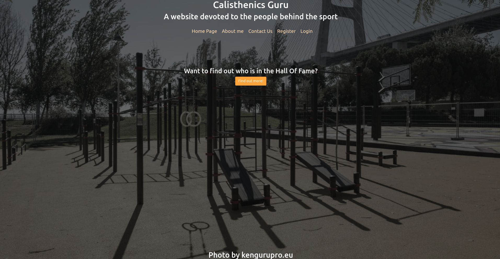

# 2023 CA229 Project02

## Description
I made the project about **Calisthenics** with the **medium of Youtubers**. The website contains meta-information about multiple youtubers that can be added to by **logging** in.
I used django to implement this project with the help of **Bootstrap 5** for many of the forms.

This website comprises of three main apps:
* Pages - A simple app designed to host informational pages such as the **About me** page. It contains content to be show.
* Youtubers - An app which handles the database of youtubers including their names, link, channel and a **Photo Upload**. There exists both an index page with all youtubers and a more detailed page about each one.
* Users - An app which handles user **login, logout and registration**. Also includes permission handling meaning only **registered users** can add content.

## Important Pages
* [youtubers_index.html](calisthenics_youtubers/youtubers/templates/youtubers/youtubers_index.html)
* [youtuber_expanded.html](calisthenics_youtubers/youtubers/templates/youtubers/youtuber_expanded.html)
* [login.html](calisthenics_youtubers/users/templates/authentication/login.html)
* [register_user.html](calisthenics_youtubers/users/templates/authentication/register_user.html)

## Important Python Files
* [user-views.py](calisthenics_youtubers/users/views.py)
* [youtubers-models.py](calisthenics_youtubers/youtubers/models.py)
* [youtubers-forms.py](calisthenics_youtubers/youtubers/forms.py)
* [youtubers-urls.py](calisthenics_youtubers/youtubers/urls.py)

